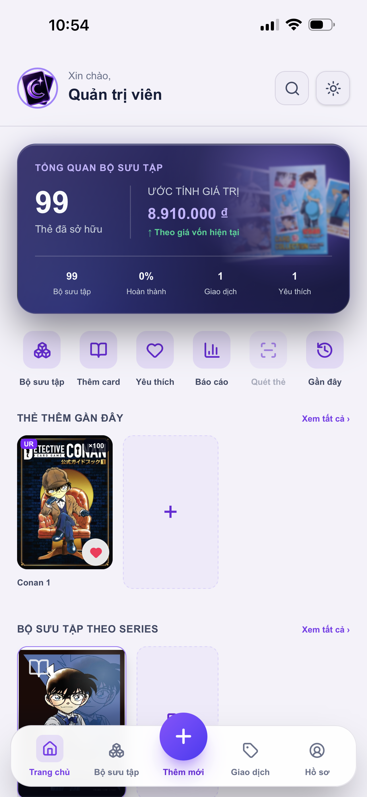
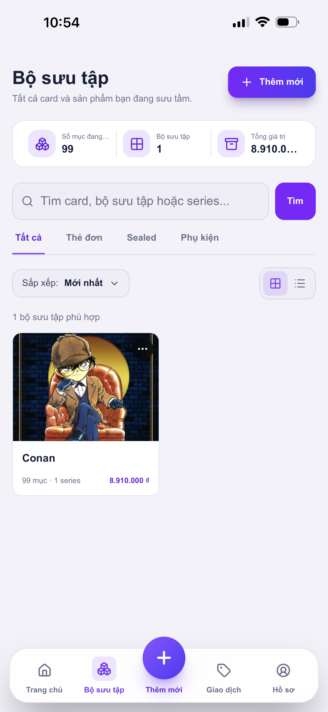
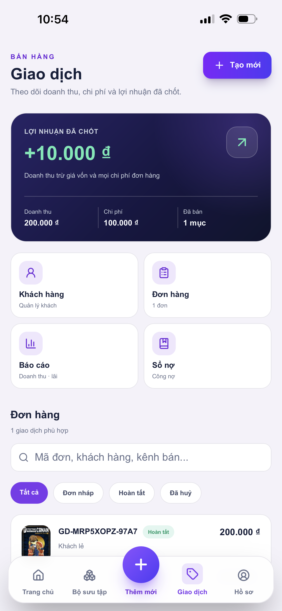
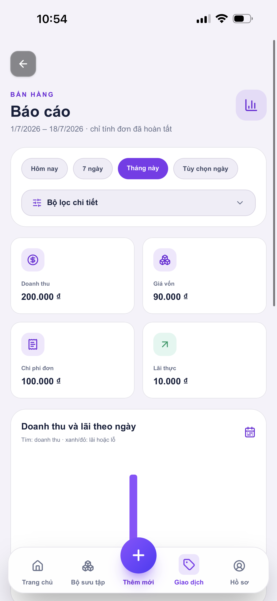
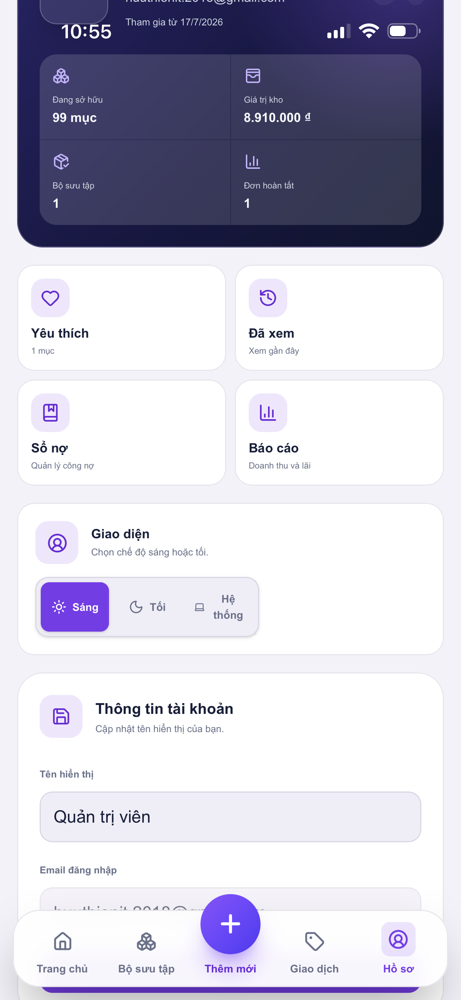
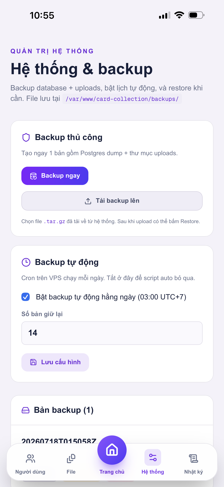

<!-- Banner / Hero -->
<p align="center">
  
</p>

<h1 align="center">Card Collection</h1>

<p align="center">
  <b>Quản lý bộ sưu tập thẻ · kho · bán hàng · công nợ · lãi/lỗ</b><br />
  <sub>Biết mình đang giữ gì · vốn bao nhiêu · bán ra lãi thế nào · ai còn nợ ai</sub>
</p>

<p align="center">
  <a href="https://github.com/Thien2026/card-collection"></a>
  <a href="#14-chạy-local--deploy"></a>
  <a href="#8-bán-hàng"></a>
</p>

<p align="center">
  
  
  
  
  
  
  
</p>

---

<p align="center">
  
  &nbsp;
  
  &nbsp;
  
</p>
<p align="center">
  
  &nbsp;
  
  &nbsp;
  
</p>

---

## Highlights

| | Module | Làm gì? |
|:---:|---|---|
| 🗂️ | **[Bộ sưu tập](#4-bộ-sưu-tập-collection)** | Gom theo IP / dòng hàng, cover + banner + mục tiêu |
| 📚 | **[Series](#5-series--bộ)** | Chia nhỏ trong bộ — set, đợt, loại hàng |
| 🃏 | **[Card & kho](#6-card--tồn-kho-inventory)** | Mẫu thẻ + từng bản thật (SKU, vốn, tình trạng) |
| 📸 | **[Upload ảnh](#7-thêm-card--upload-ảnh)** | Drop · camera · crop 2.5:3.5 · HEIC → WebP |
| 💸 | **[Bán hàng](#8-bán-hàng)** | Đơn · kênh · thanh toán · hoàn một phần/toàn bộ |
| 📒 | **[Sổ nợ](#9-khách-hàng--sổ-nợ)** | Khách nợ mình / mình nợ khách, lịch sử rõ |
| 📊 | **[Báo cáo](#10-báo-cáo)** | Doanh thu · giá vốn · chi phí · lãi thực |
| 🛡️ | **[Admin](#12-quản-trị-hệ-thống)** | User · file · backup DB + ảnh tự động |

---

<details>
<summary><b>Mục lục đầy đủ</b></summary>

1. [Vì sao app này tồn tại?](#1-vì-sao-app-này-tồn-tại)
2. [Card Collection là gì?](#2-card-collection-là-gì)
3. [Mô hình dữ liệu cốt lõi](#3-mô-hình-dữ-liệu-cốt-lõi)
4. [Bộ sưu tập (Collection)](#4-bộ-sưu-tập-collection)
5. [Series / Bộ](#5-series--bộ)
6. [Card & tồn kho (Inventory)](#6-card--tồn-kho-inventory)
7. [Thêm card & upload ảnh](#7-thêm-card--upload-ảnh)
8. [Bán hàng](#8-bán-hàng)
9. [Khách hàng & sổ nợ](#9-khách-hàng--sổ-nợ)
10. [Báo cáo](#10-báo-cáo)
11. [Trang chủ, yêu thích, hồ sơ](#11-trang-chủ-yêu-thích-hồ-sơ)
12. [Quản trị hệ thống](#12-quản-trị-hệ-thống)
13. [Công nghệ](#13-công-nghệ)
14. [Chạy local & deploy](#14-chạy-local--deploy)

</details>

---

## 1. Vì sao app này tồn tại?

Người sưu tầm / bán card thường gặp mấy vấn đề này:

| Vấn đề ngoài đời | Hệ quả |
|---|---|
| Thẻ nằm rải rác binder, hộp, album | Không nhớ còn bao nhiêu bản, bản nào đã bán |
| Giá mua ghi sổ tay / Excel / chat | Khó tính lãi thật khi bán |
| Bán FB / Shopee / gặp mặt lẫn lộn | Không biết kênh nào lãi, đơn nào còn treo |
| Khách trả thiếu / trả thừa / hoàn hàng | Công nợ “trong đầu”, dễ quên, dễ cãi |
| Ảnh thẻ chụp lung tung | Khi bán phải lục ảnh lại, nhìn không chuyên |

**Excel không đủ** vì card có quan hệ lồng nhau (bộ → series → thẻ → từng bản trong kho), có trạng thái (còn / giữ chỗ / đã bán), có ảnh, có lịch sử bán–hoàn, có sổ nợ theo khách.

**Card Collection** ra đời để gom toàn bộ vòng đời đó vào một chỗ:

> Nhập kho có ảnh & giá vốn → tổ chức theo bộ sưu tập → bán có đơn & công nợ → hoàn được → báo cáo lãi/lỗ theo thời gian.

Không phải sàn trading P2P. Đây là **công cụ vận hành kho + bán hàng** cho người giữ / buôn card.

---

## 2. Card Collection là gì?

Ứng dụng web (mobile-first) giúp bạn:

- **Quản lý bộ sưu tập**: phân tầng Bộ sưu tập → Series → Card
- **Quản lý từng bản trong kho**: tình trạng, giá vốn, vị trí lưu, SKU
- **Bán hàng**: tạo đơn, kênh bán, chi phí, thanh toán, nháp / hoàn tất
- **Hoàn đơn**: hoàn một phần hoặc toàn bộ, trả hàng về kho, ghi sổ trả khách
- **Công nợ**: biết khách đang nợ mình hay mình đang nợ khách
- **Báo cáo**: doanh thu, giá vốn, chi phí, lãi thực theo kỳ
- **Admin**: user, file upload, backup DB + ảnh

<p align="center">
  
  &nbsp;
  
</p>

---

## 3. Mô hình dữ liệu cốt lõi

Hiểu hierarchy này là hiểu gần hết app:

```text
Người dùng (User)
 └── Bộ sưu tập (Collection)          ← ví dụ: "Conan"
      └── Series / Bộ                   ← ví dụ: "Detective Conan Vol.1"
           └── Card (mẫu thẻ)           ← ví dụ: "Conan 1" · UR
                └── Inventory item × N  ← từng bản thật trong tay (SKU riêng)
                     └── Sale item      ← khi bán / hoàn
```

**Ví dụ thực tế**

Bạn mua 3 lá cùng một mẫu UR:

- 1 **Card** tên “Conan 1” (thông tin chung: tên, rarity, ảnh, series…)
- 3 **Inventory item** (3 SKU): có thể khác tình trạng / giá vốn / vị trí binder
- Khi bán 1 lá → chỉ 1 inventory chuyển `SOLD`; 2 lá còn lại vẫn `AVAILABLE`

---

## 4. Bộ sưu tập (Collection)

### Bộ sưu tập quản lý cái gì?

**Bộ sưu tập** là “ô lớn” gom mọi thứ thuộc một thế giới / IP / dòng sản phẩm bạn đang theo — ví dụ *Detective Conan*, *Pokémon*, *One Piece*.

Nó trả lời câu hỏi:

- Mình đang theo bao nhiêu dòng?
- Dòng này còn bao nhiêu mục trong kho?
- Vốn đang nằm ở dòng nào nhiều nhất?
- Tiến độ sưu tầm (nếu đặt mục tiêu số lượng) thế nào?

### Các thông tin của một bộ sưu tập

| Trường | Ý nghĩa | Lợi ích |
|---|---|---|
| **Tên** | Tên bộ (vd. Conan) | Nhận diện nhanh |
| **Ảnh cover** | Ảnh đại diện trên lưới | Nhìn là biết bộ nào |
| **Banner rộng** | Ảnh đầu trang chi tiết (tỷ lệ rộng) | Trang bộ nhìn “có hồn”, dễ nhận diện |
| **Màu chủ đạo** | Màu accent / fallback khi chưa có ảnh | Đồng bộ giao diện bộ |
| **Năm bắt đầu** | Năm bạn bắt đầu theo / năm phát hành | Lọc / ghi nhớ ngữ cảnh |
| **Số lượng mục tiêu** | Target số item muốn đủ | Tính % hoàn thành |
| **Mô tả** | Ghi chú tự do | Ghi nguồn hàng, chiến lược thu… |

### Trong màn Bộ sưu tập bạn làm được gì?

- Xem tổng số mục đang giữ, số bộ, tổng giá trị (theo giá vốn)
- Tìm card / bộ / series
- Lọc theo loại: **Thẻ đơn · Sealed · Phụ kiện**
- Sắp xếp (mới nhất, tên, số thẻ, giá trị…)
- Xem dạng lưới hoặc danh sách
- Vào từng bộ để xem series, thống kê, thiết lập

<p align="center">
  
</p>

### Thiết lập & thống kê trong một bộ

- **Thiết lập**: sửa tên, cover, banner, màu, mục tiêu, mô tả
- **Thống kê**: tổng mục, tổng giá trị, giá trị TB, số series, phân bố tình trạng, thống kê theo từng series
- **Hoạt động gần đây**: thêm / bán trong bộ

---

## 5. Series / Bộ

### Series là gì? Vì sao phải có?

Trong một IP lớn (vd. Conan), hàng trăm / hàng nghìn thẻ nếu để phẳng sẽ loạn.

**Series** (hay “Bộ”) là lớp chia nhỏ bên trong bộ sưu tập:

```text
Conan (Collection)
 ├── Detective Conan Vol.1     ← Series
 ├── Movie Memorial             ← Series
 └── Promo / Event             ← Series
```

**Vì sao cần Series?**

| Không có Series | Có Series |
|---|---|
| Một list hàng trăm thẻ | Chia theo set / đợt phát hành / loại hàng |
| Khó biết set nào còn thiếu | Theo dõi tiến độ từng series (mục tiêu riêng) |
| Thêm thẻ dễ gắn nhầm chỗ | Bắt buộc chọn Collection + Series khi thêm |
| Báo cáo chỉ theo IP | Báo cáo / lọc theo series cụ thể |

> Trong hệ thống, Series **không phải bảng riêng**: nó là Category con (`parentId` trỏ về bộ sưu tập gốc). Cách này giữ một mô hình đơn giản nhưng đủ phân cấp.

### Series quản lý những gì?

Giống collection ở mức mô tả:

- Tên, cover, màu, năm, số mục tiêu, mô tả
- Danh sách card / sản phẩm thuộc series
- Tổng số mục, tổng giá trị, % hoàn thành
- Lọc series: có thẻ / trống / hoàn thành / chưa hoàn thành / có yêu thích
- Trong series còn lọc theo loại hàng: thẻ đơn, booster, hộp, phụ kiện

**Khi thêm card**, bạn phải chọn:

1. Bộ sưu tập  
2. Series / Bộ  

(Có thể tạo nhanh collection hoặc series ngay trong form thêm thẻ — không cần thoát ra ngoài.)

---

## 6. Card & tồn kho (Inventory)

### Card là gì?

**Card** = *mẫu thẻ / sản phẩm* (catalog entry).  
Nó mô tả “đây là món gì”, không phải “tôi đang cầm bao nhiêu bản”.

Mỗi card **thuộc một Series** (và gián tiếp thuộc Bộ sưu tập cha).

### Các trường của Card

| Trường | Ví dụ | Lợi ích |
|---|---|---|
| **Tên** | Conan 1 | Tìm kiếm, hiển thị |
| **Set / phiên bản** | Vol.1 / Movie | Phân biệt bản in khác nhau |
| **Số thẻ / mã SP** | 001/100, SKU nhà cung cấp | Đối chiếu catalog |
| **Nhân vật** | Conan Edogawa | Lọc theo nhân vật |
| **Độ hiếm** | UR, SR, R… | Nhận diện giá trị sưu tầm |
| **Ghi chú** | Hàng Nhật, có tem… | Thông tin không formal hoá được |
| **Ảnh** (tối đa 5) | Mặt trước / sau / góc | Bán hàng, đối chiếu |
| **Ảnh đại diện** | Ảnh đầu tiên | Thumbnail toàn app |

### Inventory item — từng bản thật trong tay

Một card có thể có **nhiều bản** trong kho. Mỗi bản là một `InventoryItem` với **SKU riêng**.

| Trường | Ví dụ | Lợi ích |
|---|---|---|
| **SKU** | tự sinh, unique | Theo dõi từng tấm cụ thể |
| **Loại** | Thẻ đơn / Sealed / Phụ kiện | Lọc kho & báo cáo đúng loại hàng |
| **Tình trạng** | MINT, NM, LP, MP, HP, DMG | Giá bán phụ thuộc condition |
| **Grading / điểm** | PSA 10, BGS 9.5… | Hàng chấm điểm |
| **Giá vốn** | 90.000 đ | Tính lãi khi bán |
| **Ngày mua** | 17/07/2026 | Tuổi hàng, phân tích |
| **Vị trí lưu** | Binder A / Trang 12 | Tìm nhanh khi đóng hàng |
| **Trạng thái** | AVAILABLE / RESERVED / SOLD | Tránh bán trùng |
| **Ảnh / ghi chú riêng** | (tuỳ) | Ghi chú bản cụ thể |

**Trạng thái kho**

| Status | Nghĩa |
|---|---|
| `AVAILABLE` | Còn, có thể bán |
| `RESERVED` | Đang nằm trong đơn nháp |
| `SOLD` | Đã bán (đơn hoàn tất) |

Khi **hoàn đơn**, item được chọn quay lại `AVAILABLE` và có thể bán lại.

---

## 7. Thêm card & upload ảnh

### Luồng thêm

1. Chọn loại hàng:
   - **Card đơn**
   - **Sản phẩm sealed** (booster, box, display…)
   - **Phụ kiện** (binder, sleeve, playmat…)
2. Upload / chụp ảnh
3. Điền tên, chọn Bộ sưu tập + Series (tạo nhanh được)
4. Điền set, số thẻ, rarity, nhân vật (tuỳ loại)
5. Số lượng, giá mua, ngày mua, vị trí, tình trạng
6. Lưu → tạo Card + N inventory (nếu số lượng > 1)

### Upload ảnh — chi tiết

Đây không phải “chọn file rồi thôi”. Flow được thiết kế cho người hay chụp bằng điện thoại:

| Khả năng | Chi tiết |
|---|---|
| **Kéo–thả (drag & drop)** | Thả ảnh vào vùng upload khi chưa có ảnh |
| **Thư viện / Camera** | Chọn từ máy hoặc chụp trực tiếp |
| **Nhiều ảnh** | Tối đa **5 ảnh / card** |
| **Định dạng** | JPG, PNG, WebP, AVIF, GIF, TIFF, **HEIC/HEIF** (iPhone) |
| **Giới hạn dung lượng** | ~**10 MB / ảnh** |
| **Crop tỷ lệ thẻ** | Khung **2.5 : 3.5** (chuẩn card) |
| **Chỉnh ảnh** | Kéo căn, zoom 0.35–4×, xoay ±90°, “Hiện đủ ảnh” / “Vừa khung” |
| **Thứ tự** | Ảnh đầu = ảnh đại diện toàn hệ thống |
| **Xử lý server** | Chuẩn hoá **WebP** chất lượng cao, tự xoay EXIF, resize tối đa 2048×2048 |

Ảnh lưu theo user (không lẫn giữa các tài khoản):

```text
uploads/users/<userId>/
  tmp/…                  ← upload tạm
  cards/<cardId>/1.webp
  collections/<id>/cover.webp
  collections/<id>/banner.webp
  collections/<id>/series/<id>/cover.webp
```

Phục vụ qua API `/api/uploads/...` (có kiểm soát quyền truy cập).

---

## 8. Bán hàng

Bán hàng là nửa “kinh doanh” của app: không chỉ ghi “đã bán”, mà theo dõi **đơn → tiền → lãi → hoàn → công nợ**.

<p align="center">
  
</p>

### 8.1 Tổng quan màn Giao dịch

- **Lợi nhuận đã chốt**, doanh thu, chi phí, số món đã bán
- Lối tắt: **Khách hàng · Đơn hàng · Báo cáo · Sổ nợ**
- Danh sách đơn: tìm theo mã / khách / kênh
- Tab trạng thái: Tất cả · Nháp · Hoàn tất · Đã huỷ · Đã hoàn

### 8.2 Tạo đơn bán

1. Chọn các **inventory đang AVAILABLE** (theo nhóm card + tình trạng + giá vốn)
2. Đặt **giá bán** từng tấm hoặc theo nhóm
3. Chọn khách:
   - Khách đã lưu
   - Tạo khách nhanh
   - **Khách lẻ** (chỉ tên, không vào sổ khách)
4. Chọn **kênh bán**: Facebook · Shopee · TikTok · Offline / gặp mặt · Khác
5. (Tuỳ chọn) **Chi phí đơn** + nhãn (ship, phí sàn, đóng gói…)
6. Ghi chú
7. Hai hướng lưu:
   - **Lưu nháp** → đơn `DRAFT`, hàng `RESERVED` (giữ chỗ, chưa chốt)
   - **Xác nhận bán** → đơn `COMPLETED`, hàng `SOLD`

### 8.3 Thanh toán khi chốt đơn

- Nhập số tiền khách trả + phương thức (tiền mặt / CK / ví / khác)
- Nếu trả **thiếu hoặc thừa** so với bill → **bắt buộc gắn khách** để ghi công nợ
- Chi phí đơn **không trừ vào tiền khách trả**; dùng để tính lãi:

```text
Lãi ≈ Doanh thu hàng (chưa hoàn) − Giá vốn − Chi phí đơn
```

Mỗi dòng bán **snapshot giá vốn** lúc bán (`SaleItem.costPrice`) — sau này sửa giá vốn kho không làm lệch lịch sử đơn cũ.

### 8.4 Đơn nháp / huỷ / xoá

| Hành động | Kết quả |
|---|---|
| Hoàn tất đơn nháp | `COMPLETED`, hàng `SOLD` |
| Huỷ / xoá nháp | Hàng trả `AVAILABLE` |
| Đơn đã hoàn tất | Không huỷ trực tiếp — dùng **Hoàn đơn** |

### 8.5 Hoàn đơn (toàn phần / một phần)

Khi khách trả hàng hoặc bạn cần rút lại một phần đơn:

- Chọn **từng mục** cần hoàn (không bắt buộc hoàn hết)
- Hệ thống:
  - Đánh dấu `SaleItem` đã hoàn
  - Trả inventory về `AVAILABLE` (bán lại được)
  - Tạo bản ghi `SaleRefund`
  - (Nếu có khách + tiền trả > 0) ghi phiếu **mình → khách** trên sổ
  - (Tuỳ chọn) ghi **chi phí hoàn**
- Gợi ý số tiền trả:
  - Tỷ lệ theo phần hàng hoàn × số đã thu
  - Nút nhanh: đủ giá trị hàng / tối đa đã thu / **0đ chỉ hoàn kho**
- Hoàn hết mục còn lại → đơn `REFUNDED`
- Hoàn một phần → vẫn `COMPLETED` nhưng gắn nhãn **Hoàn một phần**
- **Khách lẻ**: vẫn hoàn kho + chi phí; không tạo dòng sổ khách

### 8.6 Mã đơn & lịch sử trên thẻ

- Mỗi đơn có mã dạng `GD-…`
- Trang chi tiết thẻ xem được lịch sử bán / hoàn gắn với từng inventory — biết lá nào từng bán giá bao nhiêu, lãi bao nhiêu

---

## 9. Khách hàng & sổ nợ

### Hồ sơ khách

Lưu: tên, SĐT, email, địa chỉ, ghi chú.  
SĐT / email không trùng trong cùng một tài khoản user.

### Công nợ tính thế nào?

```text
Số dư = Giá trị hàng chưa hoàn
       + Tiền mình đã trả / hoàn cho khách
       − Tiền khách đã trả cho mình
```

| Số dư | Ý nghĩa trên UI |
|---|---|
| **> 0** | Khách đang nợ mình |
| **< 0** | Mình đang nợ khách |
| **= 0** | Đã cân |

Hai chiều thanh toán:

- `CUSTOMER_TO_US` — khách trả tiền
- `US_TO_CUSTOMER` — mình trả / hoàn tiền cho khách

### Sổ nợ

- Danh sách khách kèm số dư
- Lọc: khách nợ mình / mình nợ khách
- Chi tiết khách: lịch sử tăng–giảm công nợ, đơn mua, thanh toán, hoàn (kèm giải thích trả thừa / trả thiếu)

---

## 10. Báo cáo

<p align="center">
  
</p>

Báo cáo bán hàng giúp trả lời: *tháng này lãi thật bao nhiêu?*

- Kỳ: Hôm nay · 7 ngày · Tháng này · Tuỳ chọn ngày
- Bộ lọc chi tiết: theo bộ sưu tập / series / sản phẩm
- Chỉ tính **đơn đã hoàn tất** (và đã trừ phần hàng hoàn)
- Chỉ số chính:
  - **Doanh thu**
  - **Giá vốn**
  - **Chi phí đơn**
  - **Lãi thực**
  - Hàng đã hoàn, chi phí hoàn
- Biểu đồ doanh thu & lãi theo ngày
- Phân tích theo kênh bán, theo collection, top sản phẩm / series
- Công nợ phát sinh trong kỳ

---

## 11. Trang chủ, yêu thích, hồ sơ

### Trang chủ

<p align="center">
  
</p>

- Tổng thẻ đang sở hữu & ước tính giá trị (theo giá vốn)
- Shortcut: Bộ sưu tập · Thêm card · Yêu thích · Báo cáo · Gần đây…
- Thẻ thêm gần đây
- Bộ sưu tập theo series

### Yêu thích & xem gần đây

- Yêu thích **card** hoặc **bộ sưu tập**
- Lịch sử xem gần đây (collection / series / card) để quay lại nhanh

### Hồ sơ

<p align="center">
  
</p>

- Thống kê đang sở hữu, giá trị kho, số bộ, đơn hoàn tất
- Lối tắt yêu thích / đã xem / sổ nợ / báo cáo
- Theme: **Sáng · Tối · Theo hệ thống**
- Đổi tên hiển thị, email đăng nhập, mật khẩu

---

## 12. Quản trị hệ thống

Dành cho tài khoản **ADMIN**.

<p align="center">
  
</p>

| Khu vực | Nội dung |
|---|---|
| **Người dùng** | Tạo tài khoản, phân quyền ADMIN/USER, đình chỉ, xoá mềm |
| **File** | Theo dõi dung lượng / file upload theo từng user |
| **Hệ thống & backup** | Backup Postgres + thư mục `uploads`, upload bản `.tar.gz` để restore, bật cron hằng ngày, số bản giữ lại |
| **Thống kê / Nhật ký** | Khu vực quản trị bổ sung |

Backup lưu trên server (vd. `/var/www/card-collection/backups/`). Nên giữ cron + retention (vd. 14 bản) trước khi thao tác lớn trên production.

---

## 13. Công nghệ

<p align="center">
  
  
  
</p>
<p align="center">
  
  
  
</p>

| Lớp | Stack |
|---|---|
| App | Next.js 16 (App Router), React 19, TypeScript |
| UI | Tailwind CSS 4, Lucide, Sonner |
| Auth | Auth.js / NextAuth v5 (email + mật khẩu) |
| DB | PostgreSQL + Prisma 6 |
| Ảnh | Sharp, HEIC convert → WebP, lưu disk `uploads/` |
| Production | PM2 + Nginx (hoặc Docker) |

Mỗi user có dữ liệu riêng (collection, kho, khách, đơn) theo `userId`.

---

## 14. Chạy local & deploy

### Biến môi trường

Copy [`.env.example`](.env.example):

| Biến | Mô tả |
|---|---|
| `DATABASE_URL` | PostgreSQL |
| `AUTH_SECRET` | Secret Auth.js |
| `OWNER_NAME` / `OWNER_EMAIL` / `OWNER_PASSWORD` | Admin tạo khi seed |

### Local

```bash
cp .env.example .env
npm install
npm run db:push
npm run db:seed
npm run dev
```

Mở http://localhost:3000 → đăng nhập bằng `OWNER_EMAIL` / `OWNER_PASSWORD`.

### Deploy VPS (rsync + PM2)

```bash
./deploy/rsync-deploy.sh
```

Script sync code, `npm ci`, `prisma generate`, build, `pm2 restart card-collection`.  
**Không** xoá `uploads/` và `.env*` trên server.

Khi đổi schema trên production:

```bash
npx prisma db push
npx prisma generate
npm run build
pm2 restart card-collection
```

### Docker (tuỳ chọn)

```bash
cp .env.example .env.production
docker compose up -d --build
docker compose run --rm app npm run db:push
docker compose run --rm app npm run db:seed
```

Chọn **PM2 hoặc Docker**, không chạy song song cùng một bản app.

### Scripts

| Lệnh | Việc |
|---|---|
| `npm run dev` | Dev |
| `npm run build` / `npm start` | Production build |
| `npm run db:push` | Đồng bộ schema |
| `npm run db:seed` | Tạo/cập nhật admin |
| `npm run lint` | ESLint |

---

## Ghi chú cuối

- Local (Neon) và production (Postgres VPS) thường là **hai DB khác nhau** — `db:push` chỉ áp dụng DB trong `DATABASE_URL` hiện tại.
- Sau hoàn đơn, cùng một inventory có thể xuất hiện ở nhiều dòng bán theo thời gian (đã bỏ unique cứng trên `inventoryItemId`).
- Ảnh và backup nằm trên đĩa server — backup định kỳ trước khi restore / migrate lớn.

---

<p align="center">
  <br />
  <b>Card Collection</b><br />
  <sub>quản lý thẻ · kho · bán · nợ · lãi</sub><br /><br />
  <a href="https://github.com/Thien2026/card-collection">
    
  </a>
</p>
